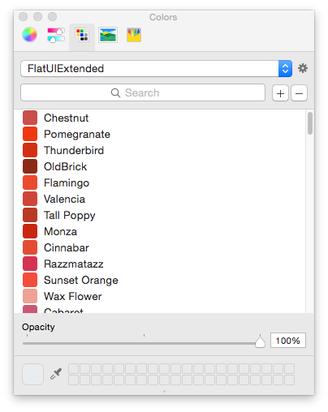

FlatUIColorPaletteXCode
=======================

FlatUI Colors (http://flatuicolors.com/) & (http://www.flatuicolorpicker.com/) palette for use in XCode.




How to Install
==============

The following command will download and copy the color file to ~/Library/Colors.

```
wget -P ~/Library/Colors https://raw.github.com/hemantasapkota/FlatUIColorPaletteXCode/master/FlatUI.clr
wget -P ~/Library/Colors https://raw.github.com/hemantasapkota/FlatUIColorPaletteXCode/master/FlatUIExtended.clr
```

Restart **XCode** to start using the palette. 

Follow me on twitter: [@hemantasapkota](https://twitter.com/ozhemanta) and don't forget to star this project.

Thanks [@v1n4yjn](https://twitter.com/v1n4yjn) for contributing to the extended palette.
