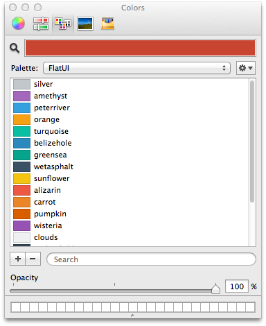

FlatUIColorPaletteXCode
=======================

FlatUI Colors (http://flatuicolors.com/) palette for use in XCode.



How to Install
==============

The following command will download and copy the color file to ~/Library/Colors.

```
wget -P ~/Library/Colors https://raw.github.com/hemantasapkota/FlatUIColorPaletteXCode/master/FlatUI.clr
```

Restart **XCode** to start using the palette.

Follow me on twitter: [@hemantasapkota](https://twitter.com/laex_pearl) and don't forget to star this project.
